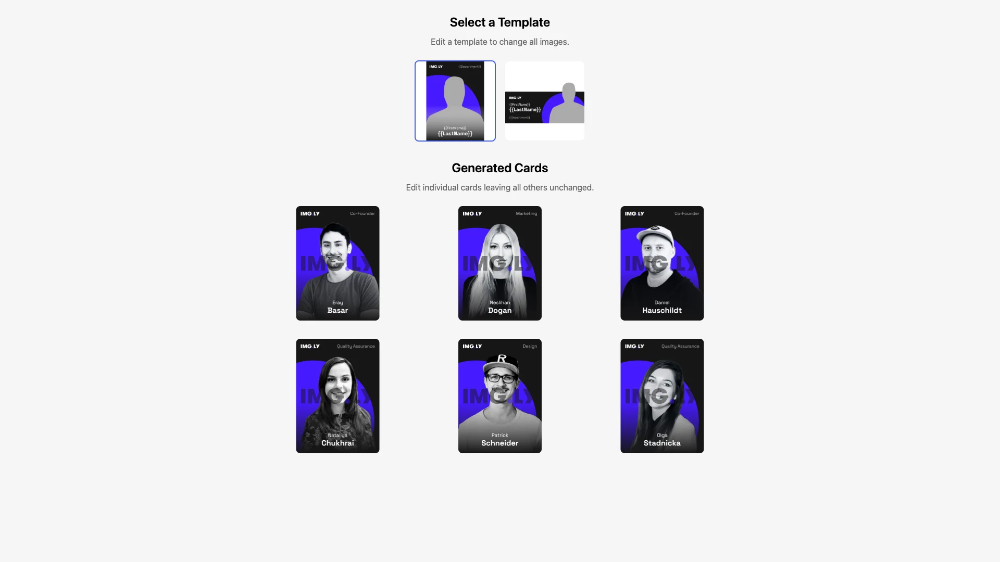

# Batch Image Generation Starter Kit

Generate personalized designs at scale — merge structured data into templates, render batches of images, and allow users to edit individual instances. Built with [CE.SDK](https://img.ly/creative-sdk) by [IMG.LY] using React.

<p>
  <a href="https://img.ly/docs/cesdk/starterkits/batch-image-generation/">Documentation</a> |
  <a href="https://img.ly/showcases/cesdk">Live Demo</a>
</p>



## Getting Started

### Clone the Repository

```bash
git clone https://github.com/imgly/starterkit-batch-image-generation-react-web.git
cd starterkit-batch-image-generation-react-web
```

### Install Dependencies

```bash
npm install
```

### Run the Development Server

```bash
npm run dev
```

Open `http://localhost:5173` in your browser.

## Configuration

### Batch Rendering

The `batchRender` function handles headless rendering of personalized images:

```typescript
import { batchRender } from './imgly';

// Render a batch of employees
const results = await batchRender(
  templateSceneString,
  items.map((emp) => ({
    images: { Photo: `/images/${emp.imagePath}` },
    variables: {
      FirstName: emp.firstName,
      LastName: emp.lastName,
      Department: emp.department
    }
  })),
  {
    license: config.license,
    baseURL: config.baseURL,
    mimeType: 'image/jpeg'
  }
);
```

### Template Editor (Creator Role)

Initialize an editor for template creation with full editing capabilities:

```typescript
import { initTemplateEditor } from './imgly';

await initTemplateEditor(cesdk, {
  title: 'My Template',
  onSave: (scene) => saveTemplate(scene),
  onClose: () => closeEditor()
});
```

### Instance Editor (Adopter Role)

Initialize an editor for editing individual instances with limited capabilities:

```typescript
import { initInstanceEditor } from './imgly';

await initInstanceEditor(cesdk, {
  title: 'John Doe - Business Card',
  onSave: (scene) => saveInstance(scene),
  onClose: () => closeEditor()
});
```

### Theming

```typescript
cesdk.ui.setTheme('dark'); // 'light' | 'dark' | 'system'
```

See [Theming](https://img.ly/docs/cesdk/web/ui-styling/theming/) for custom color schemes and styling.

### Localization

```typescript
cesdk.i18n.setTranslations({
  de: { 'common.save': 'Speichern' }
});
cesdk.i18n.setLocale('de');
```

See [Localization](https://img.ly/docs/cesdk/web/ui-styling/localization/) for supported languages and translation keys.

## Architecture

```
starterkit-batch-image-generation-react-web/
├── src/
│   ├── index.tsx             # React entry point
│   ├── app/
│   │   ├── App.tsx           # Main application component
│   │   ├── resolveAssetPath.ts # Asset path resolution for nested deployments
│   │   ├── EmployeeCard/     # Employee card display
│   │   ├── TemplateSelector/ # Template selection UI
│   │   ├── EditorModal/      # Modal wrapper for editors
│   │   └── LoadingOverlay/   # Loading state UI
│   └── imgly/
│       ├── index.ts          # Editor initialization (Template/Instance)
│       ├── batch-renderer.ts # Headless batch rendering
│       └── config/
│           ├── plugin.ts         # Main plugin orchestration
│           ├── actions.ts        # Load, Save, Export actions
│           ├── features.ts       # Feature toggles
│           ├── settings.ts       # Engine behavior
│           ├── i18n.ts           # Internationalization
│           └── ui/               # UI layout configuration
├── public/                   # Static assets
├── package.json
└── vite.config.ts
```

## Key Capabilities

- **Batch Rendering** – Generate personalized images at scale using the headless engine
- **Role-Based Editing** – Creator role for template design, Adopter role for instance editing
- **Variable System** – Personalize templates with dynamic content fields
- **Modal-Based Editor** – Full-screen editor overlay with resource management
- **Dual SDK Integration** – Combines @cesdk/engine and @cesdk/cesdk-js

## Prerequisites

- **Node.js v20+** with npm – [Download](https://nodejs.org/)
- **React 18+** – This starter kit uses React for UI components
- **Supported browsers** – Chrome 114+, Edge 114+, Firefox 115+, Safari 15.6+

## Troubleshooting

| Issue | Solution |
|-------|----------|
| Editor doesn't load | Verify assets are accessible at `baseURL` |
| Batch renders fail | Check engine is initialized before rendering |
| Watermark appears | Add your license key |

## Documentation

For complete integration guides and API reference, visit the [Batch Image Generation Documentation](https://img.ly/docs/cesdk/starterkits/batch-image-generation/).

## License

This project is licensed under the MIT License - see the [LICENSE](LICENSE) file for details.

---

<p align="center">Built with <a href="https://img.ly/creative-sdk?utm_source=github&utm_medium=project&utm_campaign=starterkit-batch-image-generation">CE.SDK</a> by <a href="https://img.ly?utm_source=github&utm_medium=project&utm_campaign=starterkit-batch-image-generation">IMG.LY</a></p>
